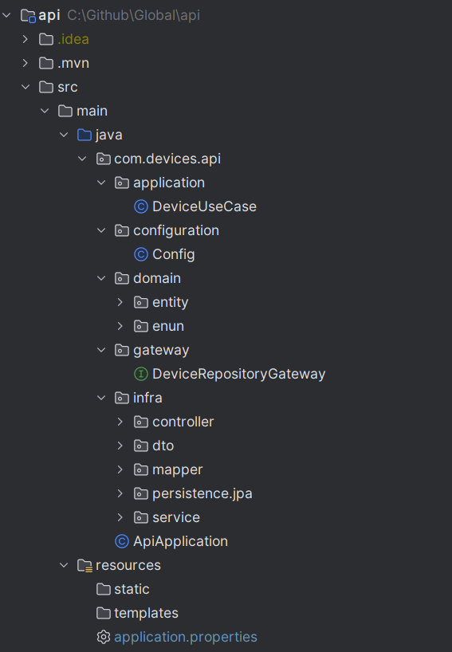

# Devices API

API RESTful desenvolvida em **Java 21** com **Spring Boot 3.5.7**, responsável pelo gerenciamento de dispositivos (devices).  
O sistema implementa arquitetura em camadas, separando domínio, aplicação e infraestrutura, com testes unitários e de persistência.

---

##  Estrutura do Projeto

## Tecnologias Utilizadas

| Categoria | Tecnologia |
|------------|-------------|
| Linguagem | Java 21 |
| Framework | Spring Boot 3.5.7 |
| ORM | Spring Data JPA / Hibernate |
| Banco de dados | PostgreSQL (produção) / H2 (testes) |
| Documentação | Springdoc OpenAPI (Swagger UI) |
| Testes | JUnit 5 + Mockito + AssertJ |
| Build | Maven 3.9+ |
| Container | Docker + Docker Compose |

## Como Executar Localmente

